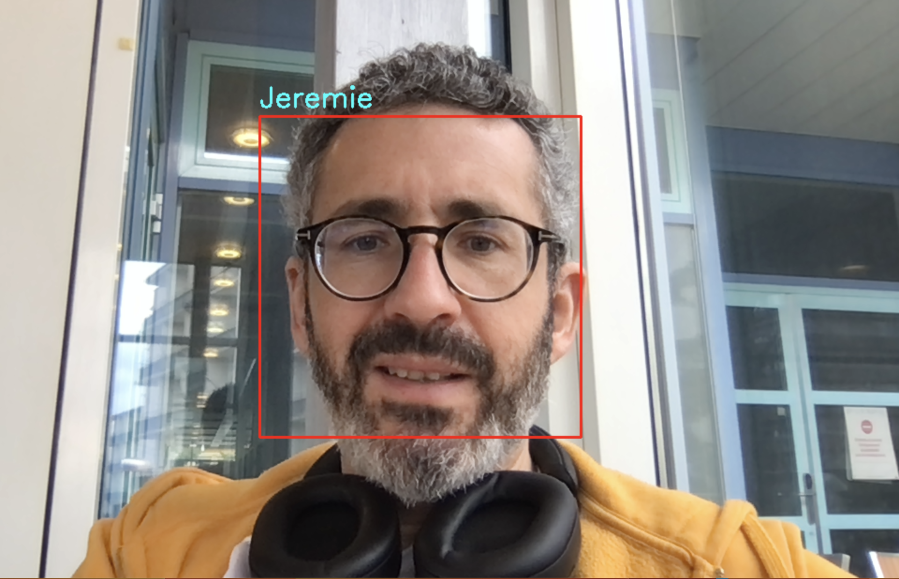

ROCHER Quentin 
LARIVIERE Angelo

# SAÉ: Modélisation mathématique
## Reconnaissance faciale en temps réel



## Description du projet

Le but de cette SAÉ est de construire un système de reconnaissance faciale qui fonctionne en temps réel.

Le système utilise la caméra de votre PC (ou une caméra externe) pour capturer des images de visages. Ainsi, un **dataset** contenant des visages de différentes personnes associées à leurs noms sera créé.

Par la suite, un **algorithme de classification** sera entraîné pour prédire le nom de la personne se trouvant devant la caméra en fonction de son visage.

## Implémentation

Les notebooks `1_dataset.ipynb` et `2_algo.ipynb` permettent d'implémenter un système de reconnaissance faciale en temps réel basé sur l'algorithme des **$k$ plus proches voisins ($k$-NN)**.

Le premier notebook traite de la création du **dataset**, tandis que le second code l'algorithme **$k$-NN** et son intégration dans un système de reconnaissance faciale en temps réel.

## Consignes

1. **Comprenez les 2 notebooks** en détail, et si nécessaire, corrigez-les jusqu'à ce qu'ils fonctionnent correctement (chez moi, ils fonctionnent).
2. **Adaptez le 2ème notebook** à d'autres algorithmes de classification de votre choix, tels que la régression logistique, les arbres de décision, etc.
3. Essayez d'adapter votre système pour le **cas d'utilisation de reconnaissance binaire** suivant : le système doit répondre `admis` ou `non admis` en fonction du visage détecté.
4. Documentez-vous sur les **réseaux de neurones** et tentez d'implémenter et d'intégrer un algorithme de classification basé sur les réseaux de neurones.
5. Si le temps vous le permet, documentez-vous sur les **réseaux de neurones convolutionnels** et tentez d'implémenter et d'intégrer un algorithme de classification basé sur les réseaux de neurones convolutionnels.
6. Soumettez votre projet sous forme d'un **répertoire GitHub**. Votre dépôt contiendra un **fichier README** (md file) ainsi que plusieurs **notebooks Jupyter** (ipynb files) clairs et commentés présentant votre projet.

## Installation des librairies pour le réseau de neurones
````shell
  python.exe -m pip install --upgrade pip
  python.exe -m pip install keras 
  python.exe -m pip install tensorflow 
````


## Explication du code

Nous avons créé un notebook pour chaque modèle utilisé. Nous avons également créé un fichier **.py** qui synthétise tout notre code pour éviter la duplication excessive. Dans ce fichier, on peut choisir la méthode à utiliser et déterminer qui, parmi les personnes enregistrées dans le dataset, est admis ou non.

## Documentation de la classe DenseNetClassifier

Pour cette classe, nous avons opté pour un modèle de réseau de neurones dense avec trois couches de neurones et une couche de sortie comportant un nombre de neurones égal au nombre de noms de personnes différentes enregistrées. La première couche contient 512 neurones, la deuxième en contient 64 et la troisième 32. Cette classe contient trois fonctions : `__init__` pour initialiser le réseau, `fit` pour entraîner le réseau et `predict` pour prédire le propriétaire du visage.

## Documentation de la classe ConvNetClassifier

Pour cette classe, nous avons choisi de créer un modèle de réseau de neurones avec deux couches. La première couche contient 32 neurones et la deuxième 16. La dernière couche est une couche de type DenseNetClassifier contenant 32 neurones. Dans ce réseau, nous utilisons également la régression linéaire. Cette classe contient également trois fonctions : `__init__`, `fit` et `predict`.

## Tests de fonctionnement

Lors de nos tests, nous avons observé que le réseau de neurones convolutionnel donnait de meilleurs résultats avec un entraînement de 500 epochs et avec un jeu de données d'au moins 40 photos par personne. Cela permet au réseau de mieux s'entraîner sur chaque individu. Pour les autres méthodes, lorsque nous ajoutons plus de deux personnes au jeu de données, la précision diminue.

## Annexes

Voici les liens qui nous ont aidés à réaliser notre réseau de neurones avec la bibliothèque Keras :
- [Documentation Keras](https://keras.io/examples/vision/image_classification_from_scratch/)
- [Application de la bibliothèque pour la reconnaissance d'image](https://www.analyticsvidhya.com/blog/2020/10/create-image-classification-model-python-keras/)
- [Problème rencontré par Angelo lors de l'installation de TensorFlow](https://stackoverflow.com/a/76085534)

________
________

Ce projet a été réalisé en 3ème année de BUT informatique en collaboration avec : Quentin ROCHER
